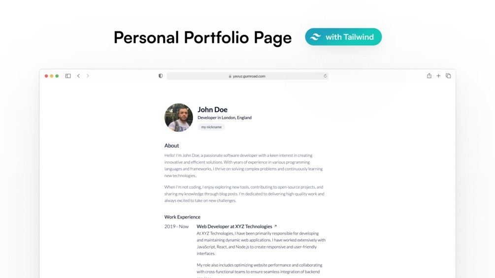

# Responsive Personal Portfolio Page Template



## Getting started

The existing page's style is sufficient with Tailwind CSS. If you want to change the style, you can run the following command in the console:

```bash
npm install -D tailwindcss
npx tailwindcss -i ./style.css -o ./tailwind.css --minify
```

If you don't need anything extra, you don't need to do anything else.

## Description

The "Responsive Personal Portfolio Page" is the perfect solution for anyone looking to create a professional online resume or portfolio. With its modern design and user-friendly interface, this single-page template is ideal for showcasing your skills, experience, contact and personal projects. Whether you're a recent graduate, a freelancer, or an experienced professional, this template will help you present yourself in the best possible light.

Features:
* Modern and Stylish Design: A clean and elegant layout that highlights your professional achievements.
* Fully Responsive: Looks great on all devices, from desktops to smartphones.
* Easy to Customize: Simple to modify and tailor to your needs with well-structured HTML, CSS, and JavaScript files.
* SEO Friendly: Optimized for search engines to help you get discovered online.

Use Cases:
* Professional Resume Website
* Personal Portfolio
* Freelancer Profile Page
* Online CV

Technical Requirements:
* Compatibility: Works with any modern web browser.
* Technology: Built with HTML, CSS, and JavaScript.